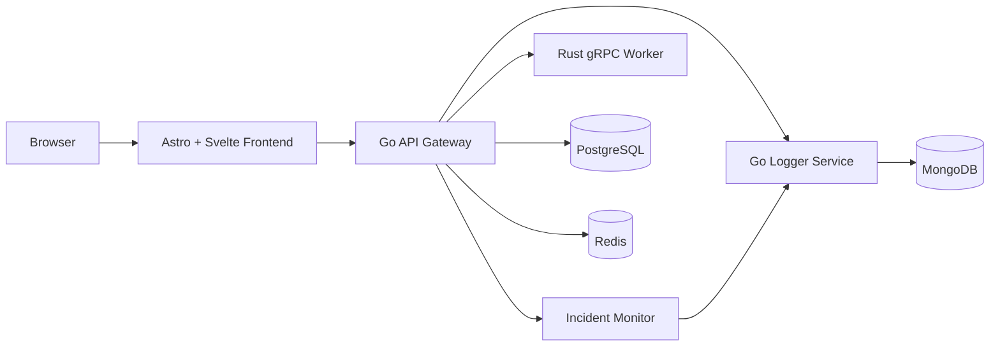

# Architecture

## 1. High-level structure

Visual asset:

- [architecture-diagram.svg](/mnt/d/w/AppFoundryLab/docs/assets/architecture-diagram.svg)

## 2. New runtime/incident flow

1. Gateway collects request metrics and health data
2. Admin endpoints expose config, metrics, and runtime report summaries
3. The incident monitor evaluates alert state changes on a timer
4. New or resolved incident events are sent to the logger service
5. Logger stores persistent incident events in MongoDB
6. Frontend shows both the current incident summary and recent incident history

## 3. Main services

- Frontend: static shell + interactive diagnostics
- API gateway: auth, RBAC, readiness, metrics, runtime diagnostics, incident report
- Logger: request logs, incident event persistence, queue metrics
- Worker: gRPC compute service

## 4. Frontend presentation state

- `BaseLayout.astro` owns the document shell, the shared preference toolbar mount, and the pre-paint reconciliation of route-correct `html[lang]` plus theme-only `html[data-theme]`
- `frontend/src/lib/ui/preferences.ts` is the canonical locale/theme store; it normalizes values, keeps the document root in sync, and persists only theme in `localStorage`
- `frontend/src/lib/ui/copy.ts` is the canonical EN/TR copy contract for shell/admin UI plus locale-aware formatters for datetime, percent, and duration values
- `frontend/src/lib/ui/routes.ts` maps logical page ids to localized URLs so `/` and `/test` stay English while `/tr` and `/tr/test` render Turkish SSR output
- `frontend/src/styles/global.scss` now defines semantic surface/text/control tokens for both light and dark modes; the dark palette is charcoal-led and the CTA accent lane is vivid orange, so components should prefer shared classes over one-off utility colors
- Locale is URL-authoritative on entry and language switching uses full-page navigation to the localized route variant; this keeps first paint, titles, and deep links SSR-correct at the cost of a route transition instead of in-place copy swapping
- Stable browser regression checks should target `data-testid`, `data-role`, `data-mode`, `data-status`, and `html[lang]` / `html[data-theme]` instead of visible translated text

## 5. Deployment shape

- local and VPS now share the same single-host Docker Compose package
- staging and production workflows call the same repository scripts over SSH
- public traffic should terminate at a reverse proxy and then forward to frontend and gateway only

## 6. Related documents

- [operations.md](/mnt/d/w/AppFoundryLab/docs/en/operations.md)
- [incident-response.md](/mnt/d/w/AppFoundryLab/docs/en/incident-response.md)
- [deployment.md](/mnt/d/w/AppFoundryLab/docs/en/deployment.md)
