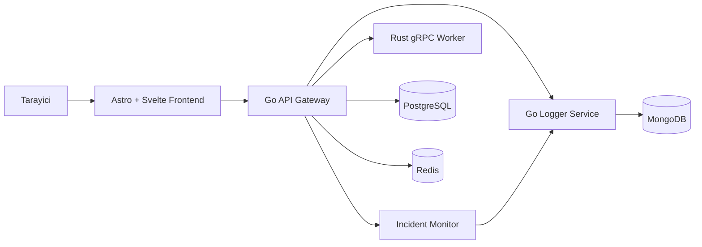

# Mimari

## 1. Ust seviye yapi

Gorsel dosya:

- [architecture-diagram.svg](/mnt/d/w/AppFoundryLab/docs/assets/architecture-diagram.svg)

## 2. Yeni runtime/incident akisi

1. Gateway request metric ve health verisini toplar
2. Admin endpoint'leri config, metrics ve runtime report ozetlerini sunar
3. Incident monitor alert durum degisimlerini periyodik olarak degerlendirir
4. Yeni veya cozulmus incident event'leri logger servisine yollar
5. Logger bu event'leri MongoDB'de kalici saklar
6. Frontend hem guncel incident ozetini hem de son incident gecmisini gosterir

## 3. Ana servisler

- Frontend: statik kabuk + etkilesimli diagnostics
- API gateway: auth, RBAC, readiness, metrics, runtime diagnostics, incident report
- Logger: request log, incident event kaliciligi, queue metrics
- Worker: gRPC hesaplama servisi

## 4. Frontend sunum durumu

- `BaseLayout.astro`, document shell'i, ortak preference toolbar mount'unu ve route-correct `html[lang]` ile theme-odakli `html[data-theme]` icin pre-paint reconcile adimini sahiplenir
- `frontend/src/lib/ui/preferences.ts`, locale/theme icin kanonik store'dur; degerleri normalize eder, document root'u guncel tutar ve sadece theme'i `localStorage` icinde kalici yapar
- `frontend/src/lib/ui/copy.ts`, shell/admin UI icin kanonik EN/TR metin sozlugu ile datetime, yuzde ve sure formatlayicilarini bir arada tutar
- `frontend/src/lib/ui/routes.ts`, mantiksal sayfa kimliklerini localized URL'lere map eder; boylece `/` ve `/test` Ingilizce kalirken `/tr` ve `/tr/test` Turkce SSR ciktisi uretir
- `frontend/src/styles/global.scss`, acik ve koyu tema icin semantik surface/text/control token'larini tanimlar; koyu tema charcoal tabanli, CTA aksani ise canli turuncudur. Bu nedenle bilesenler tekil light-only utility renkler yerine ortak siniflari tercih etmelidir
- Locale giris aninda URL tarafindan belirlenir ve dil degisimi localized route'a tam sayfa navigation ile yapilir; bu secim ilk boya, title ve deep-link davranisini SSR-correct tutarken, in-place metin degisimi yerine route gecisini trade-off olarak kabul eder
- Tarayici regression testleri gorunur cevrilmis metne degil; `data-testid`, `data-role`, `data-mode`, `data-status` ve `html[lang]` / `html[data-theme]` isaretcilerine dayanmali

## 5. Deployment sekli

- local ve VPS artik ayni tek sunucu Docker Compose paketini paylasiyor
- staging ve production workflow'lari ayni repo scriptlerini SSH uzerinden cagiriyor
- public trafik once reverse proxy'de sonlanmali ve sadece frontend ile gateway'e iletilmeli

## 6. Ilgili belgeler

- [operasyonlar.md](/mnt/d/w/AppFoundryLab/docs/tr/operasyonlar.md)
- [incident-yonetimi.md](/mnt/d/w/AppFoundryLab/docs/tr/incident-yonetimi.md)
- [deployment.md](/mnt/d/w/AppFoundryLab/docs/tr/deployment.md)
